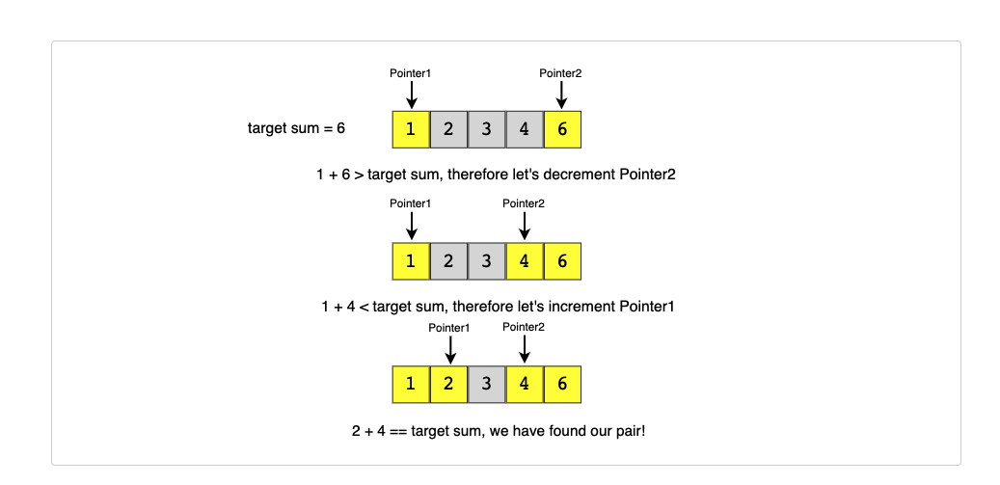

# Data structure and Algorithms


## Sliding Window

**Visualize each subarray as a sliding window of ‘K’ elements.**

This means that we will slide the window by one element when we move on to the next subarray. To reuse the `sum` from the previous subarray, we will subtract the element going out of the window and add the element now being included in the sliding window. This will save us from going through the whole subarray to find the `sum` and, as a result, the algorithm complexity will reduce to _O(N)_.


**Examples:**

```javascript
/*
 *  find_average_of_subarrays.ts
 *
 *  Given an array, find the average of all subarrays of ‘K’ contiguous elements in it.
 *
 *  Array: [1, 3, 2, 6, -1, 4, 1, 8, 2], K=5
 *  Output: [2.2, 2.8, 2.4, 3.6, 2.8]
 */

// time complexity: O(N∗K)

function find_average_of_subarrays(K: number, arr: number[]): number[] {
  let result = [];

  for (let i = 0; i < arr.length - K + 1; i++) {
    let sum = 0.0;

    for (let j = i; j < K + i; j++) {
      sum += arr[j];
    }

    result.push(sum / K);
  }

  return result;
}

// Slide Window Approach
// time complexity: O(N)

// [1, 3, 2, 6, -1, 4, 1, 8, 2];

function fin_average_of_subarrays_with_slide_window(
  K: number,
  arr: number[]
): number[] {
  let result = [];

  let windowStart = 0;
  let windowSum = 0.0;

  for (let windowEnd = 0; windowEnd < arr.length; windowEnd++) {
    // add the next element
    windowSum += arr[windowEnd];

    // slide the window, we don't need to slide if we've not hit the required window size of 'k'
    if (windowEnd >= K - 1) {
      // calculate the average
      result.push(windowSum / K);
      // subtract the element going out
      windowSum -= arr[windowStart];
      // slide the window ahead
      windowStart++;
    }
  }

  return result;
}

let arr = [1, 3, 2, 6, -1, 4, 1, 8, 2];
let k = 5;

console.log(find_average_of_subarrays(k, arr));

console.log(fin_average_of_subarrays_with_slide_window(k, arr));
```


```javascript


/*
 *  209_m_smallest_subarray_sum.ts
 *
 *  Given an array of positive numbers and a positive number ‘S,’ find the length of the smallest contiguous         	* subarray whose sum is greater than or equal to ‘S’. Return 0 if no such subarray exists.
 *
 *  Input: [2, 1, 5, 2, 3, 2], S=7
 *  Output: 2
 */


  const smallest_subarray_sum = function (s: number, arr: number[]): number {
    let min_length = arr.length;

    for (let i = 0; i < arr.length; i++) {
      let acc = 0;
      let counter = 0;

      for (let j = i; j < arr.length; j++) {
        counter++;
        acc = acc + arr[j];

        if (acc >= s) {
          if (counter < min_length) {
            min_length = counter;
          }
          break;
        }
      }
    }
    return min_length;
  };

  const smallest_subarray_sum_with_slide_window = (
    s: number,
    arr: number[]
  ): number => {
    let min_length = Infinity;
    let window_sum = 0;
    let window_start = 0;

    for (let window_end = 0; window_end < arr.length; window_end++) {
      window_sum += arr[window_end];

      while (window_sum >= s) {
        min_length = Math.min(window_end + 1 - window_start, min_length);
        window_sum -= arr[window_start];
        window_start++;
      }
    }

    if (min_length === Infinity) {
      return 0;
    }

    return min_length;
  };

  let arr = [2, 1, 5, 2, 3, 2];
  let s = 7;

  console.log(smallest_subarray_sum(7, arr));


```


## Two Pointers


Given that the input array is sorted, an efficient way to find a set of elements that fulfill certain constrains would be to start with one pointer in the begining and another pointer at the end. At every step, we will see if the numbers pointed by the two pointers add up to the target sum. If they do not, we will do one of two things:


1. If the sum of the two numbers pointed by the two pointers is greater than the target sum, this means that we need a pair with a smaller sum, So, to try more pairs, we can decrement the end-pointer.

2. If the sum of the two numbers pointed by the two pointers is smaller than the target sum, this means that we need a pair with a larger sum. So, to try more pairs, we can increment the start-pointer.




The time complexity of the above algorithm will be O(N).


**Example:**

```javascript

Input: [1, 2, 3, 4, 6], target=6
Output: [1, 3]
Explanation: The numbers at index 1 and 3 add up to 6: 2+4=6


const pair_with_targetsum = function(arr, target_sum) {
  let left = 0;
  let right = arr.length - 1;
  

  while(left < right){
    let lValue = arr[left];
    let rValue = arr[right];

    let sum = lValue + rValue


    if(sum === target_sum){
      return[left, right];
    }else if(sum > target_sum ){
      right --;
    }else{
      left ++
    }
  }
  return [-1,-1];
}


```


## Fast & Slow Pointers

The **Fast & Slow** pointer approach, also known as the **Hare & Tortoise algorithm**, is a pointer algorithm that uses two pointers which move through the array (or sequence/LinkedList) at different speeds. This approach is quite useful when dealing with cyclic LinkedLists or arrays.

By moving at different speeds (say, in a cyclic LinkedList), the algorithm proves that the two pointers are bound to meet. The fast pointer should catch the slow pointer once both the pointers are in a cyclic loop.


