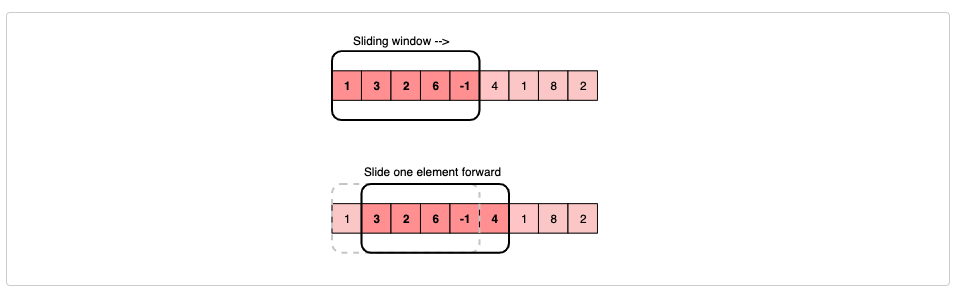

# Data structure and Algorithms

## Sliding Window

**Visualize each subarray as a sliding window of ‘K’ elements.**

This means that we will slide the window by one element when we move on to the next subarray. To reuse the `sum` from the previous subarray, we will subtract the element going out of the window and add the element now being included in the sliding window. This will save us from going through the whole subarray to find the `sum` and, as a result, the algorithm complexity will reduce to _O(N)_.



**Example:**

```javascript
/*
 *  Given an array, find the average of all subarrays of ‘K’ contiguous elements in it.
 *
 *  Array: [1, 3, 2, 6, -1, 4, 1, 8, 2], K=5
 *  Output: [2.2, 2.8, 2.4, 3.6, 2.8]
 */

// time complexity: O(N∗K)

function find_average_of_subarrays(K: number, arr: number[]): number[] {
  let result = [];

  for (let i = 0; i < arr.length - K + 1; i++) {
    let sum = 0.0;

    for (let j = i; j < K + i; j++) {
      sum += arr[j];
    }

    result.push(sum / K);
  }

  return result;
}

// Slide Window Approach
// time complexity: O(N)

// [1, 3, 2, 6, -1, 4, 1, 8, 2];

function fin_average_of_subarrays_with_slide_window(
  K: number,
  arr: number[]
): number[] {
  let result = [];

  let windowStart = 0;
  let windowSum = 0.0;

  for (let windowEnd = 0; windowEnd < arr.length; windowEnd++) {
    // add the next element
    windowSum += arr[windowEnd];

    // slide the window, we don't need to slide if we've not hit the required window size of 'k'
    if (windowEnd >= K - 1) {
      // calculate the average
      result.push(windowSum / K);
      // subtract the element going out
      windowSum -= arr[windowStart];
      // slide the window ahead
      windowStart++;
    }
  }

  return result;
}

let arr = [1, 3, 2, 6, -1, 4, 1, 8, 2];
let k = 5;

console.log(find_average_of_subarrays(k, arr));

console.log(fin_average_of_subarrays_with_slide_window(k, arr));
```
