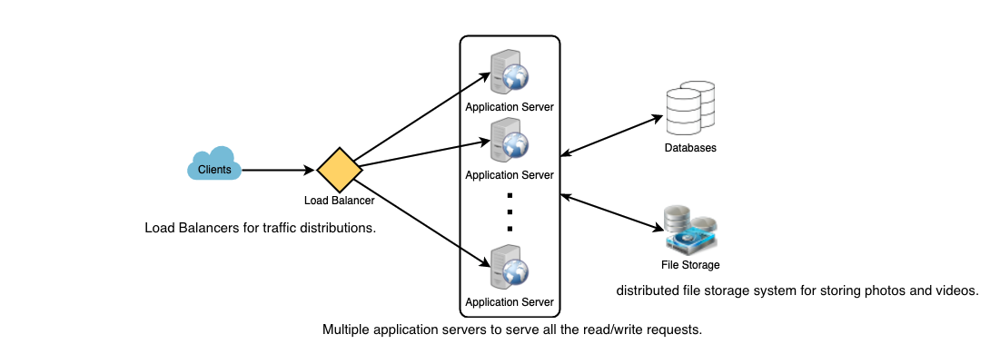
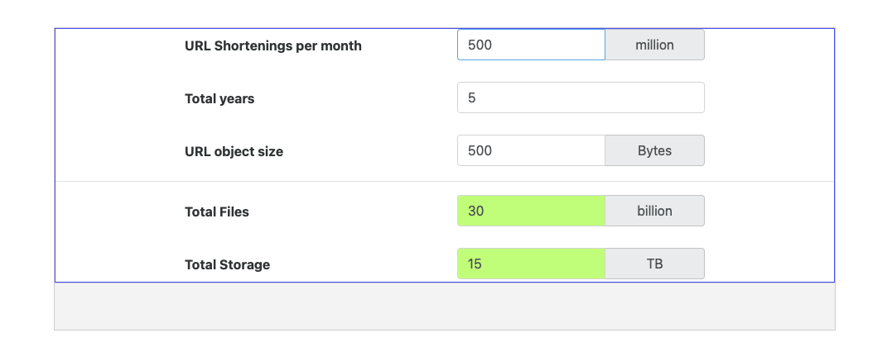
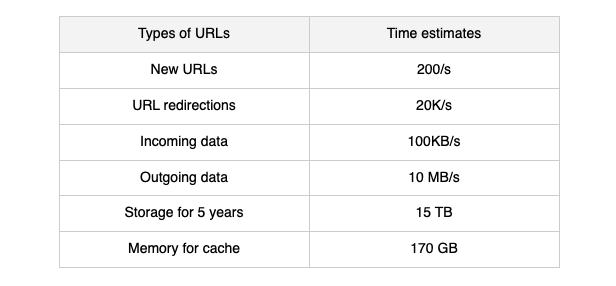

# System Design


## A step by step guide


**Step 1: Requirements clarifications**

Ask questions about the exact scope of the problem we are trying to solve.

**Functional Requirement, Non-Functional Requirement, extended Requirement**

Twitter like service:

* Post tweets and follow other people?
* User's timeline?
* Tweets contain photos and videos?
* Backend only or including front-end too?
* Search tweet?
* Display hot trending topics?
* Push notification for new (or important tweets)?


**Step 2: back-of-the-envelope estimation**

Estimate the scale of the system for scaling, partitioning, load balancing, and caching.

* What scale? (number of new tweets,  tweet views, timeline generations per sec., etc. ).
* How much storage? (different storage requirements if users can have photos and videos in the tweets).
* What network bandwidth usage? (for managing traffic and balance load between servers).


**Step 3: System interface definition**

Define the APIs are expected from the system.

```javascript
postTweet(user_id, tweet_data, tweet_location, timestamp, ...)
```

```javascript
generateTimeline(user_id, current_time, user_location, ...)
```

```javascript
markTweetFavorite(user_id, tweet_id, timestamp, ...)
```


**Step 4: Defining data model**

Defining the data model  will clarify how data will flow between different system components.


**User**: UserID, Name, Email, DoB, CreationDate, LastLogin, etc.

**Tweet**: TweetID, Content, TweetLocation, NumberOfLikes, TimeStamp, etc.

**UserFollow**: UserID1, UserID2

**FavoriteTweets**: UserID, TweetID, TimeStamp


**Step 5: High-level design**

Draw a block diagram with 5-6 boxes representing the core components of our system. We should identify enough components that are needed to solve the actual problem from end to end.





**Step 6: Detailed design**

Dig deep into two or three major components. Follow interviewer's feedback. We should present different approaches, their pros and cons, and explain why we will prefer one approach over the other. 

**The only important thing is to consider tradeoffs beetween different options while system constraints in mind.**


* How should we partition our massive amount of adata to distribute it to multiple databases. Store all the data of a user on the same database? What issue could it cause?
* How to handle hot users who tweet a lot or follow lots of people?
* Since users' timeline will contain the most recent tweets, should we try to store our data so that it is optimized for scanning the latest tweets?
* How much and at which layer should we introduce cache to speed things up? (Redis)
* What components need better load balancing?


**Step 7: Identifying and resolving bottlenecks**

Try to discuss as many bottlenecks as possible and different approaches to mitigate them.

* Is there any single point of failure in our system? What are we doing to mitigate it?
* Do we have enough replicas of the data so we can still serve our users if we lose a few servers?
* Do we have enough copies of different services running such that a few failures will not cause a total system shutdown?
* How are we monitoring the performance of our service? Do we get alerts whenever cirtical components fail or their performace degrades?


## Designing a URL Shortening service like TinyURL


**1. Why do we need URL shortening?**

Short links save a lot of space when displayed, printed, messaged, or tweeted and less likely to mistype shorter URLs.


**2. Requrements and Goals of the System**

Our URL shortening system should meet the following requirements:


**Functional Requirements:**

1. Given a URL, our service should generate a shorter and unique alias of it, it sholud be easily copied and pasted into applications.
2. When user access the short link, our service should redirect them to the original link.
3. Users should be able to pick a custom short link for their URL.
4. Links will expired after a standard default timespan, Users should be able to specify the expiration time.


**Non-Functional Requirements:**

1. The system should be highly available. (required) If the service si down, all the URL redirections will start failing.
2. URL redirection should happen in real-time with minimal latency.
3. Shotened links should not be guessable (not prediectable).


```java


```


**Extended Requirements:**

1. Analytics; e.g., how many times a redirection happened?
2. Our service shold be accessible through REST APIs by other services.


**3. Capacity Estimation and Constraints**

Our system will be read heavy.

Let's assume a 100:1 ratio between read and write.


**Traffic estimates**: 

Assuming, we will have 500M new URL shortenings per month, 

We expect 50B redirection during the same period:

**100 * 500M = 50B** 

New URLs shortenings per second:

**500 million / (30 days * 24 hours * 3600 seconds) = ~200 URLs/s**

URLs redirections per second will be:

**100 * 200 URLs/s = 20K/s**


**Storage estimates:** 

Assuming, we store every URL shortening request for 5 years

The total number of objects we expect to store will be 30 billion:

500 million * 5 years * 12 months = 30 billion

Assume that each stored object will be approximately 500 bytes, we will need 15TB of total storage:

30 billion * 500 bytes = 15 TB





**Bandwidth estimates:** 

For **write requests,** since we expect 200 new URLs every second, total incoming data for our service will be 100KB per second:

**200 * 500 bytes = 100 KB/S**

For **read requests,** since every second we expect ~20K URLs redirections, total outgoling data for our service would be 10MB per second:

**20000 * 500 = 10MB/S**


**Memory estimates:**

Cache some of the hot URLs that are frequently accessed following the 80-20 rule, we would like to cache these 20% hot URLs.

Since we have 20K request per second, we will be getting 1.7 billion requests per day:

**20K * 3600 seconds * 24 hours = ~1.7 billion**

To cache 20% of these requests, we will need 170GB of memory:

**0.2 * 1.7 billion * 500 bytes = ~1.7GB**

*Since there will be many duplicate requests (of the same URL), our actual memory usage will be less than 170GB.*


**High-level estimates:**

Assuming 500 million new URLs per month and 100:1 read:write ratio, following is the summary of the high level estimates for our services:




**4. System APIs**

Definitions of the APIs for creating and deleting URLs:

```javascript
createURL(api_dev_key, original_url, custom_alias=None, user_name=None, expire_date=None)
```


**Parameters:**

**Api_dev_key(string):** The API developer key of a registered account. This will be used to, among other things, throttle users based on their allocated quota.

**Original_url(string)**

**Custom_alias(string):** Original custom key for URL.

**user_name:** Optional user name to be used in the encoding.

**expire_date:** Optional expiration date for the shortened URL.


**Returns:** (string)

A successful insertion returns the shortened URL; otherwise, it returns an error code.


```javascript
deleteURL(api_dev_key, url_key);
```


**url_key:** a string representing the shortened URL to be retrieved; a successful deletion returns 'URL Removed'.


**How to detect and prevent abuse?** (consuming all URL keys in the current design)

limit users via `api_dev_key`. 

Each `api_dev_key ` can be limited to a certain number of URL creations and redirections per some time period (which may be set to a different duration per developer key).

e.g. (one day only ten URLs can be created)


